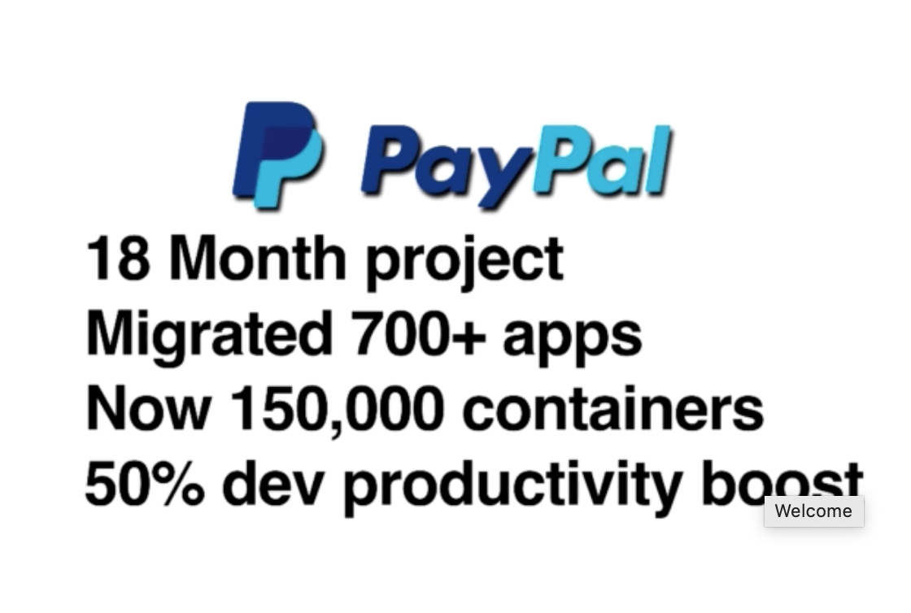
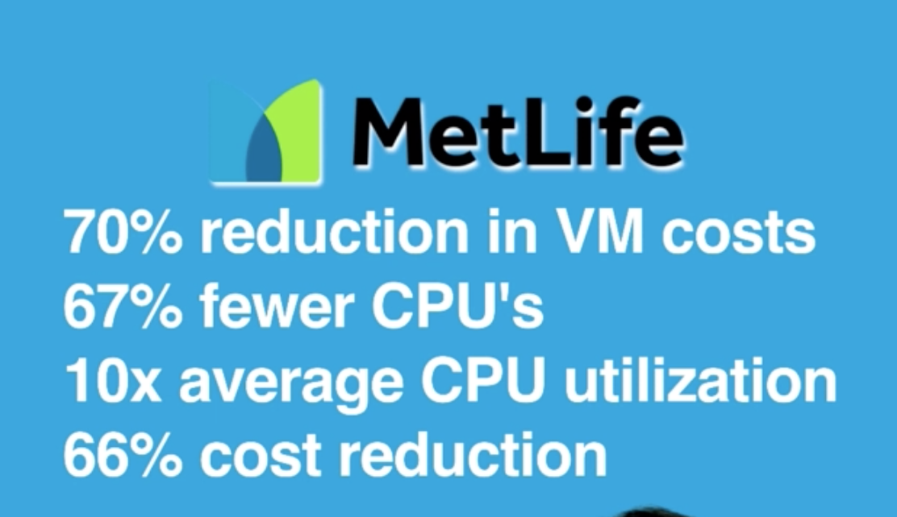
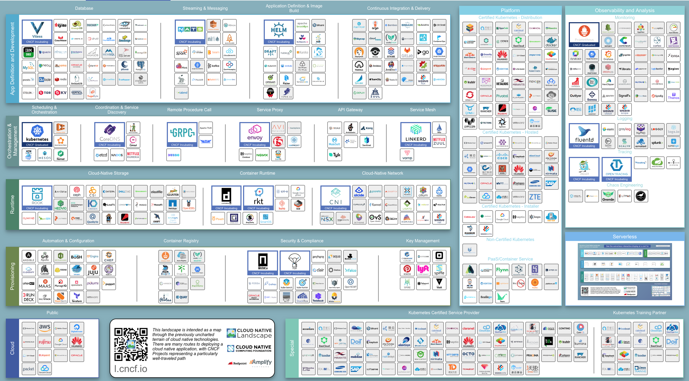
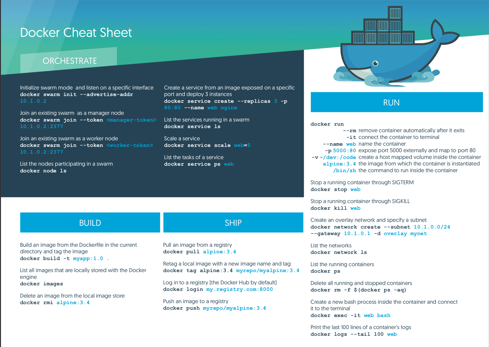

#### Docker-Mastery notes

### Section 1

## Why Docker?

Containers are the next once-in-a-decade shift in infrastrucutre and process that make or break you.

Let's Recap
Major Infrastrucutre Shifts:

- Mainframe to PC
    - 90's
- Baremetal to Virtual
    - 00's
- Datacenter to Cloud
    - 10's
- Host to Container (Serverless)
    - Now

Like all these shifts, migrating is the hard part. We need to learn new terminology and move infrastructure.
Yet, unliek previous shifts, Docker is focused on the migration experience. Built for developers, sysadmins, ops teams etc.

Containers are the "Fastest Growing Cloud Enabling Technology"

> Fun Fact:
> - @Moby Dock is the logo.
> - @GordonTheTurtle is the mascot

Docker is all about speed.
- Develop Faster
- Build Faster
- Test Faster
- Deploy Faster
- Update Faster
- Recover Faster

The "Matrix from Hell" Breeds Complexity. Each website, database, queues have different environments and.
Containers allows us to run and test the software anywhere we are running it: cloud, windows, linux etc.

Maintenance and complexity drains budgets, so innovation suffers.

There are a lot of major companies that use Docker today.

Examples:



https://landscape.cncf.io/format=landscape


git clone https://github.com/BretFisher/udemy-docker-mastery.git




### Section 2
Docker Editions
- Docker is no longer just a"container runtime"
- Docker moves fast, it matters how you install it
- Docker CE (Community Edition)
- Three major types of installs: Direct, Mac/Win, Cloud
- Linux (different per distro)(don't use default package)
- Docker for Windows (or legacy Docker Toolbox)
- Docker for Mac (or legacy Docker Toolbox)(don't use brew)
- Docker for AWS/Azure/Google

CE vs EE, Stable vs. Edge
- Docker CE (free) vs. Docker EE (paid)
- EE = Enterprise Edition
- EE = Support + extra products
- EE = Certified on specific platforms
- docker.com/pricing
- Edge (beta) released monthly, Stable quarterly
- Edge gets new features first, but only support for a month
- Stable rolls in 3 months of Edge features, EE supported longer.

> Note: Don't use homebrew (brew install docker), it's docker CLI only.

Docker for Mac Tips
- Bash Command Completion
    - https://docs.docker.com/docker-for-mac/#installing-bash-completion
- Code paths enabled for Bind Mounts (/Users by default)
- Bind mounts work for code and (usually) databases
- RUn more nodes: docker-machine create --driver
    - Fusion, VirtualBox, Parallels etc. https://docs.docker.com/machine/drivers/
- Great Dockerfile/Compose file editor: Visual Studio Code
    - https://code.visualstudio.com/
- Great Terminal replacement: iTerm2
    - https://www.iterm2.com/
- Great info and troubleshooting/FAQ
    - https://docs.docker.com/docker-for-mac/
- My Shell Setup (iTerm2 + oh-my-zsh + much more)
    - https://www.bretfisher.com/shell

### Section 3, Lecture 18:
```bash
docker version: Returns the version of your client and server.
```

```bash
docker info: Shows most configuration values for the engine.
```
```bash
docker: Returns list of commands you can use with docker.
```
> docker command line structure:
    - old (still works): docker <command> (options)
    - new: docker <command> <sub-command> (options)

When Docker was adding more commands, they realise the list was growing too big and they placed them under Management commands in order to make it easier to find commands.

### Section 3 Lecture 19

Image vs. Container
- An image is the application we want to run (binaries)
- A container is an instance of that image running as a process
- You can have many containers running off the same image
- Docker's default image "registry" is called Docker Hub

docker container run --publish 80:80 nginx

1. Downloaded image 'nginx' from Docker Hub
2. Started a new container from that image
3. Opened port 80 on the host IP
4. Routes the traffic to the container IP, port 80

```bash
docker container ls: Prints list of running containers
```
```bash
 docker container stop: Stops the container process but doesn't remove it.
```
Run vs. Start
```bash
*docker container run* always starts a new container
use *docker container start* to start an existing stopped one
```
```bash
*docker container logs container_name*: Prints all logs for this container.
```
```bash
docker container rm: Remove (delete) one or more containers
```
What happens in 'docker container run'
1. Looks for that image locally in image cache, doesn't find anything
2. Then looks in remote image repository (defaults to Docker Hub)
3. Downloads the latest version (nginx:latest by default)
4. Creates new container based on that image and prepares to start
5. Gives it a virtual IP on a private network inside docker engine
6. Opens up port 80 on host and forwards to port 80 in container (if not supplied it doesn't open the ports)
7. Starts container by using the CMD in the image Dockerfile


Containers aren't Mini-VM's
- They are just processes
- Limited to what resources they can access
- Exit when process stops

```bash
docker top: List running processes within specific container
```

```bash
ps aux: show me all running processes
```

Assignment: Manage Multiple Containers

- docs.docker.com and --help are your friend
- Run a nginx, a mysql, and a httpd (apache) server
- Run all of them --detach (or -d), name them with --name
- nginx should listen on 80:80, httpd o 8080:80, mysql on 3306:3306
- When running mysql, use the --env option (oe -e) to pass in MYSQL_RANDOM_ROOT_PASSWORD=yes
- Use docker container logs on mysql to find the random password it created on startup
- Clean it all up with docker container stop and docker container rm (both can accept multiple names or IDs)
- Use docker container ls to ensure everything is correct before and after cleanup